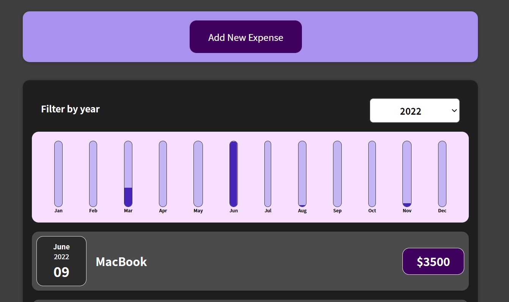
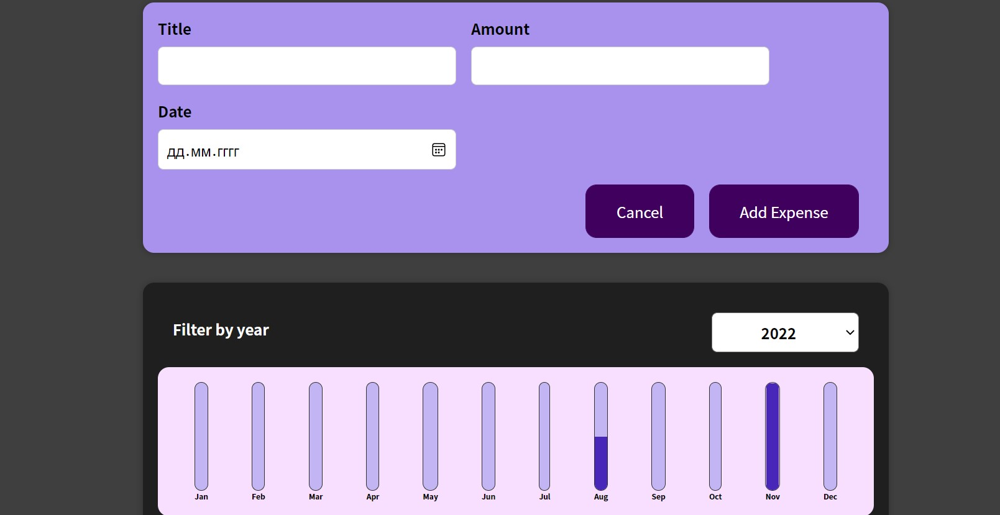
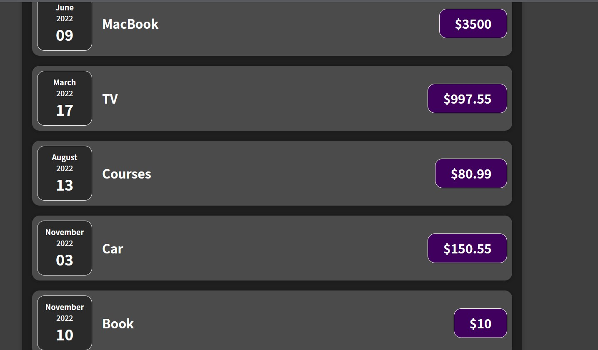

### Expenses

# Getting Started with Create React App

This project was [Create React App](
-To work, you need to install Node.js

In the project directory, you can run:

### `npm start`

Runs the app in the development mode.\
Open [http://localhost:3000](http://localhost:3000) to view it in your browser.

